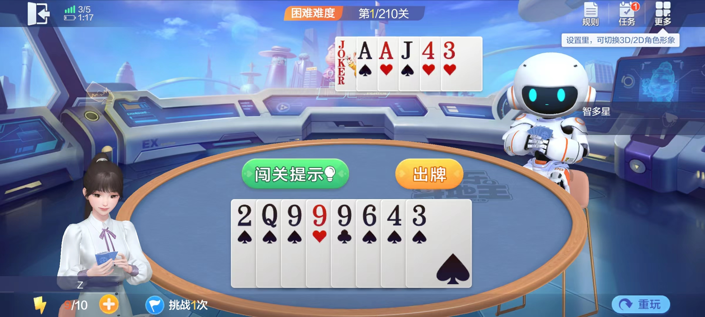
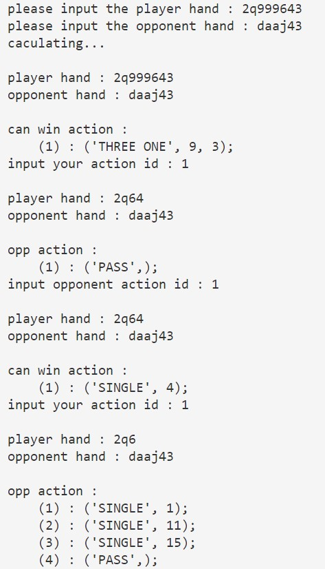

# Landlords
使用动态规划以及最大最小搜索思想暴力求解斗地主残局模式

## 简介
斗地主残局模式是基于斗地主出牌规则，对方手牌可见的1v1模式，玩家需找到一个必胜出牌策略。


## to use
```
python play.py
```
You can use the program's prompts to figure out the endgame


## sample 
